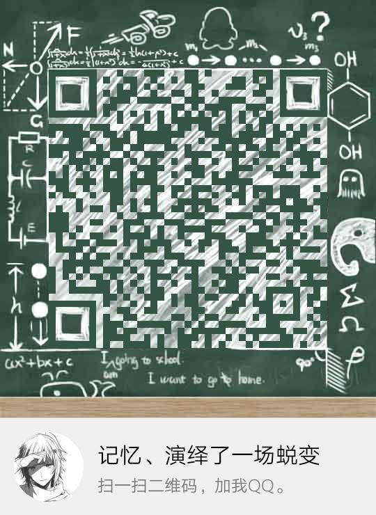
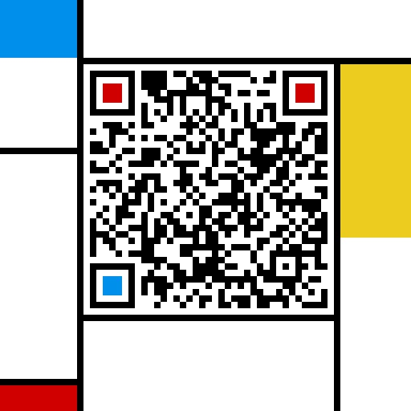

# 一些无聊作品

> 查看地址: <https://g.febby315.top/>
> 开源地址: <https://github.com/Febby315/code_wallpaper>

## 1. 分类

### 1.1. 壁纸类

- [ ] [Wallpaper](./wallpaper1/) 文字云壁纸
- [ ] [ripples](./ripples/) 水波纹壁纸

### 1.2. 特效类

- [ ] [ImageView](./ImageView/) 懒加载+全屏+透明+滚屏
- [ ] [keyboard](./keyboard/) 模拟键盘

### 1.3. 工具类

- [ ] [video Player](./player/index.html) 视频直播播放器
- [ ] [FLAC Player](./player/music.html) Flac无损播放器

### 1.4. 网红特效

- [x] [Char Picture Player](./TXTplayer/) 字符画播放器v1
- [x] [Char Picture Player](./TXTplayer/v2.html) 字符画播放器v2
- [x] [Char Picture Player](./TXTplayer/v3/index.html) 字符画播放器v3
- [x] [Time Compass](./date/) 时间罗盘

#### 1.4.1 字符画播放器

> v1&v2版本功能较不完善建议查看v3版本

- 支持url传参控制
- 支持图片(jpeg/png/gif/webp等)及视频(mpeg/webm/avi等)

url参数说明
|参数|默认值|可选值|说明|
|:-:|:-:|:-:|:-:|
|src|"video/v.mp4"|URI|资源链接地址必须允许跨域访问|
|enableColor|false|any|启用彩色字符|
|enableReverse|false|any|启用反转(仅反转灰度字符映射&前景色&背景色)|
|className|空|String\|Array\<String\>|暂只支持<br/>"shadow":红色阴影|
|style|空|String|经过encodeURIComponent函数编码的JSON字符串|

``` js
// src 显示素材(素材需支持跨域访问)
src = encodeURIComponent("https://i.loli.net/2019/09/02/yOHcCG7XlFVv4M5.png")
// enableColor 启用颜色(非空即真)
enableColor = 1
// enableReverse 启用反转(非空即真)
enableReverse = 1
// className 自定义增加的class属性
className = ["shadow", { "isActive": true }]
// style 自定义样式
style = encodeURIComponent(JSON.stringify({ transform: "scale(0.8)" }))
```

> - enableColor 此选项对设备性能消耗巨大,默认关闭
> - transform scale 字符画缩放(n<-1:反转&放大, -1<n<0:反转&缩小, 0<n<1:仅缩小, 1<n:仅放大)

简单示例:
> <https://g.febby315.top/TXTplayer/v3/?src=https%3A%2F%2Fi.loli.net%2F2019%2F09%2F02%2FyOHcCG7XlFVv4M5.png&enableColor=1&className=shadow>

完整示例:
> <https://g.febby315.top/TXTplayer/v3/?src=https%3A%2F%2Fi.loli.net%2F2019%2F09%2F02%2FyOHcCG7XlFVv4M5.png&enableColor=1&enableReverse=1&className=shadow&style=%7B%22transform%22%3A%22scale(0.8)%22%7D>

## 关于我

|Tencent|Wechat|
|:-:|:-:|
|||
